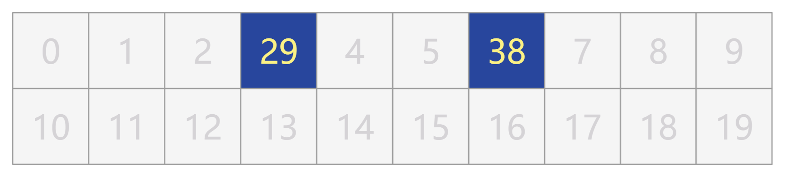
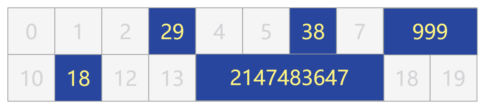
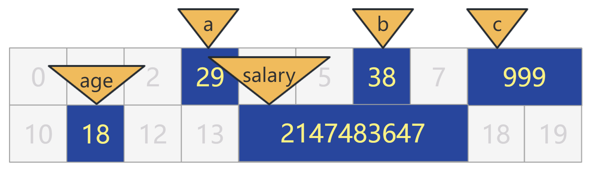
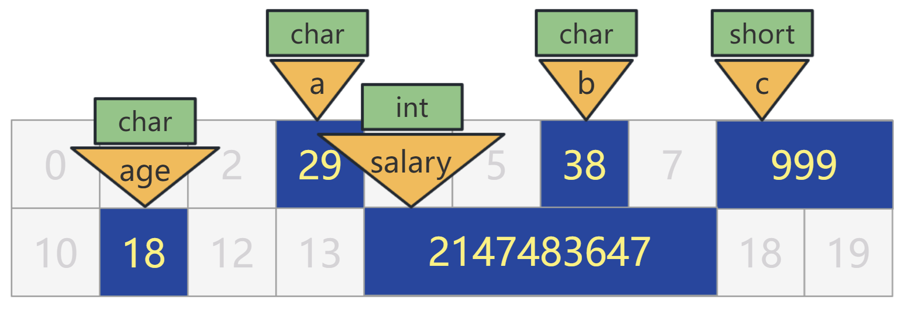
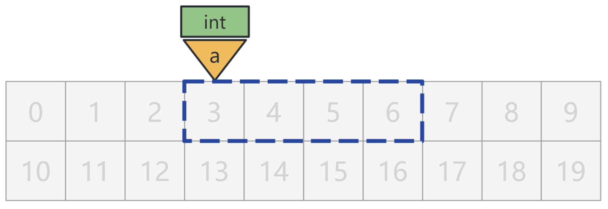
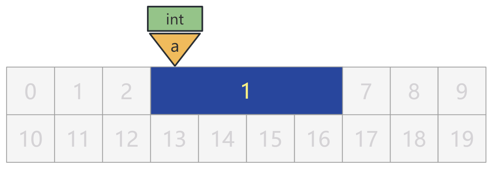
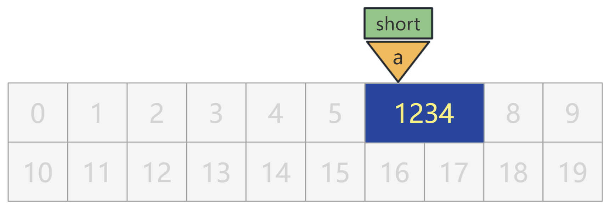

# 你管这破玩意叫指针

内存，通常被严谨地画成下面这个样子，一个下方是低地址上方是高地址的格子楼。


但我今天换种画法，像下面这个样子。


每个格子代表内存中的 1 个字节（8 位），格子上的数字就代表内存地址，我也直接用 10 进制来表示了。目前内存是完全空的，格子里没有任何内容。

试想一下，如果你忘掉所有的编程语言和编程规范，你会如何描述你对这些内存格子的操作呢？


## 类型系统

很简单，往格子 3 处放个数字 29，往格子 6 处放个数字 38，就这么描述即可。



但是这样说话太麻烦了，什么往格子 3 处放个数字 29 的，废话太多。

那我们就定个指令，使用 mov $x, (y) 表示把数字 x 放入格子 y，如下：

```
mov $29, (3)
mov $38, (6)
```

这就表示刚刚说的：

```
把数字 29 放入内存格子 3
把数字 38 放入内存格子 6
```

是不是太简单了？别急，好戏马上开始！

如果要把数字 999 放入内存格子 8，该怎么办呢？

由于 1 个格子只有 8 位，因此只能表示 256 个数字，要么是有符号的 -128 ~ 127，要么是无符号的 0 ~255，显然数字 999 无法放在一个格子内，只能占用两个格子了。

那也好办，就这么说，把数字 999 放入格子 8，连续占用两个格子。


但这样，我们刚刚的 mov 指令就得改改了，不但要表示"存放"这个含义，还得表示占用了多少个格子。

我们用 movb 表示只占 1 个字节，用 movw 表示占用 2 个字节。那么，刚刚的三个数字，就分别可以这样用指令来表示了：

```
movb $29, (3)
movb $38, (6)
movw $999, (8)
```

含义就是：

```
把数字 29 放入内存格子 3，占 1 个字节
把数字 38 放入内存格子 6，占 1 个字节
把数字 999 放入内存格子 8，占 2 个字节
```

OK，既然有了 1 字节和 2 字节的的指令，不妨再设计下，用 movl 表示 4 字节，movq 表示 8 字节 ...

```
movb 占用 1 字节
movw 占用 2 字节
movl 占用 4 字节
movq 占用 8 字节
```

不知不觉，类型系统就被你悄悄设计出来了！当然，虽然这只是个半成品。


## 变量

你不断地往不同格子里放数据。

比如我把我的年龄放在 11 号格子（占 1 字节），把我的月薪放在 14 号格子（占 4 字节）。



现在我们的内存已经非常混乱了，你根本记不住原来的 3 号格子放的数据表示什么，11 号格子又表示什么，只能通过看数字知道 14 号格子里放的确实是我的月薪。这该怎么办呢？

增加一层抽象嘛！我们给这些放了我们数据的格子，都贴上个标签，就可以不用再记那些无意义的格子编号了。



这样以来，其实我们也不再关心，这些标签到底在哪个格子里，只要给我找到格子把我的数据放进去就可以了。

```
movb $29, a
movb $38, b
movw $999, c
movb $18, age
movl $2147483647, salary
```

当然，我还需要再通过这个标签，把我刚刚放进去的数据找出来。

这很简单，但存在一个问题，放进去的时候，我们可以通过 movb，movw，movl 等知道占用多少个格子。而取出来的时候，标签上可没有写这个数据占用了多少个格子，这是有问题的。

因此，在定义这个标签时，不能光取个名字，还需要有个信息就是，这个标签对应的数据，占了多少个格子。

我们就效仿刚刚的存放操作，也规定一系列单词，来修饰这些标签，表示占用了多少个格子。

char 表示 1 个字节，short 表示 2 个字节，int 表示 4 个字节，long 表示 8 个字节 ...



于是乎刚刚的 5 个数据，就可以表示为如下指令：

```
char a = 29;
char b = 38;
short c = 999;
char age = 18;
int salary = 2147483647;
```

行了，我也别藏着掖着了，相信大家也知道，这里就是 C 语言的写法，而刚刚那堆 mov 是汇编语言的写法。

这些 char a，char b，int salary 等，就是变量！记住，变量不但要有名字，还得有类型！


## 变量定义与赋值

其实，刚刚写法，是把变量的定义与赋值操作写在一行了。

比如有如下语句：

```
int a = 1;
```

实际上是分成两步的：

```
// 变量的定义
int a;
// 变量的赋值
a = 1;
```

其中变量的定义是为了程序员后面去用它赋值，这部分不是给 CPU 看的。



而变量的赋值才是真正在内存中把数据放进去，这部分才真正涉及 CPU 具体指令的执行。




## 指针

现在，让我们把内存清空，回到一开始的那一片净土上。


现在，我来搞点花样。我将我的密码（1234）存储在一个 short a 中，假设这个变量 a 被放在了 6 号格子处。



同时，我将这个变量 a 的地址，也就是 6 这个数字，存储在另一个变量 int p 中，假设这个变量 p 被放在了 1 号格子处。


这样，我寻找我密码的方式，就是先通过 p 所在的内存地址找到里面存的值，也就是 a 的内存地址 6，再通过 a 的内存地址找到里面存的值，也就是我要找的密码 1234。


## 参考资料与工具

GNU C Manual：https://www.gnu.org/software/gnu-c-manual/gnu-c-manual.html

在线观察 C 语言的汇编代码：https://godbolt.org/

