# 你管这破玩意叫指针 -- 基础篇

本系列分三篇，用破玩意的方式彻底理解好指针的本质：

你管这破玩意叫指针 -- 基础篇

你管这破玩意叫指针 -- 进阶篇

你管这破玩意叫指针 -- 变态篇

话不多说，开始！！

内存，通常被严谨地画成下面这个样子，一个下方是低地址上方是高地址的格子楼。

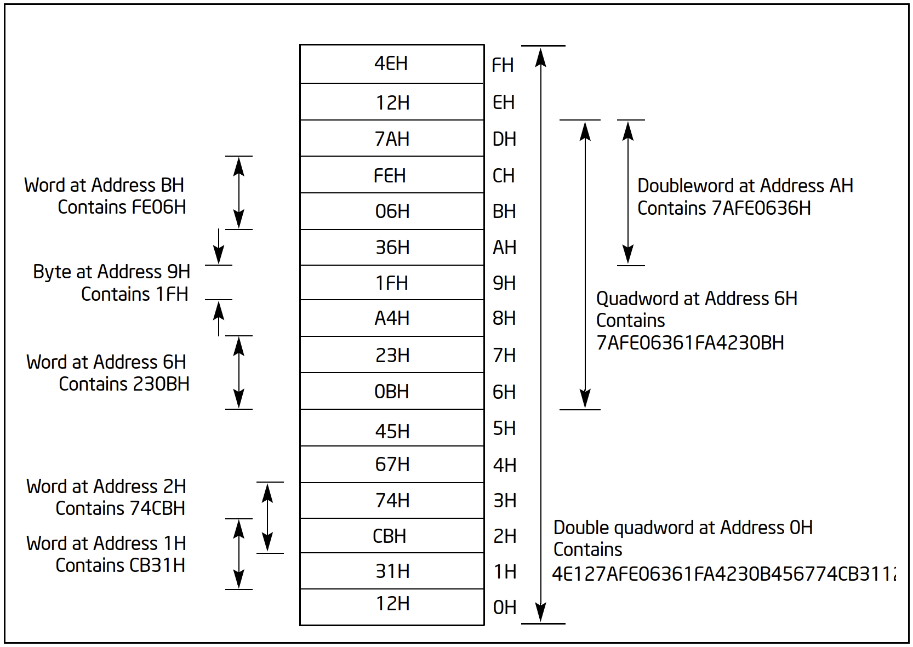

但我今天换种画法，像下面这个样子。

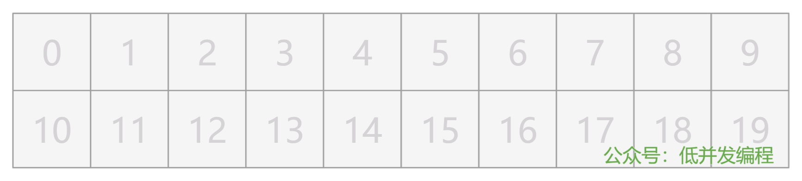

每个格子代表内存中的 1 个字节（8 位），格子上的数字就代表内存地址，我也直接用 10 进制来表示了。目前内存是完全空的，格子里没有任何内容。

试想一下，如果你忘掉所有的编程语言和编程规范，你会如何描述你对这些内存格子的操作呢？


## 类型系统

很简单，往格子 3 处放个数字 29，往格子 6 处放个数字 38，就这么描述即可。

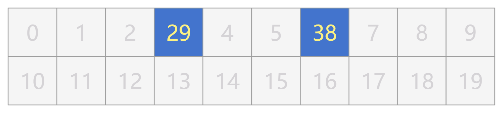

但是这样说话太麻烦了，什么往格子 3 处放个数字 29 的，废话太多。

那我们就定个指令，使用 mov $x, (y) 表示把数字 x 放入格子 y，如下：

```
mov $29, (3)
mov $38, (6)
```

这就表示刚刚说的：

```
把数字 29 放入内存格子 3
把数字 38 放入内存格子 6
```

是不是太简单了？别急，好戏马上开始！

如果要把数字 999 放入内存格子 8，该怎么办呢？

由于 1 个格子只有 8 位，因此只能表示 256 个数字，要么是有符号的 -128 ~ 127，要么是无符号的 0 ~255，显然数字 999 无法放在一个格子内，只能占用两个格子了。

那也好办，就这么说，把数字 999 放入格子 8，连续占用两个格子。

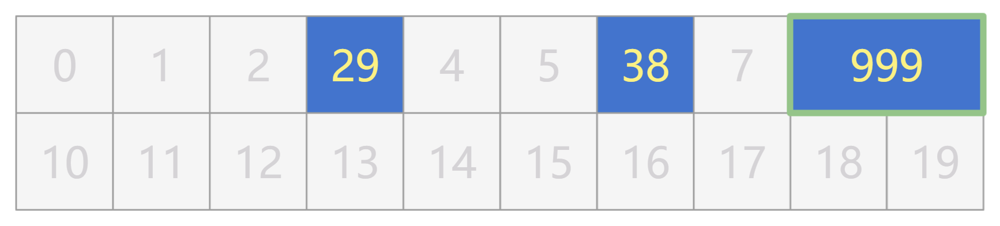

但这样，我们刚刚的 mov 指令就得改改了，不但要表示"存放"这个含义，还得表示占用了多少个格子。

我们用 movb 表示只占 1 个字节，用 movw 表示占用 2 个字节。那么，刚刚的三个数字，就分别可以这样用指令来表示了：

```
movb $29, (3)
movb $38, (6)
movw $999, (8)
```

含义就是：

```
把数字 29 放入内存格子 3，占 1 个字节
把数字 38 放入内存格子 6，占 1 个字节
把数字 999 放入内存格子 8，占 2 个字节
```

OK，既然有了 1 字节和 2 字节的的指令，不妨再设计下，用 movl 表示 4 字节，movq 表示 8 字节 ...

```
movb 占用 1 字节
movw 占用 2 字节
movl 占用 4 字节
movq 占用 8 字节
```

不知不觉，类型系统就被你悄悄设计出来了！当然，虽然这只是个半成品。


## 变量

你不断地往不同格子里放数据。

比如我把我的年龄放在 11 号格子（占 1 字节），把我的月薪放在 14 号格子（占 4 字节）。


现在我们的内存已经非常混乱了，你根本记不住原来的 3 号格子放的数据表示什么，11 号格子又表示什么，只能通过看数字知道 14 号格子里放的确实是我的月薪。这该怎么办呢？

增加一层抽象嘛！我们给这些放了我们数据的格子，都贴上个标签，就可以不用再记那些无意义的格子编号了。

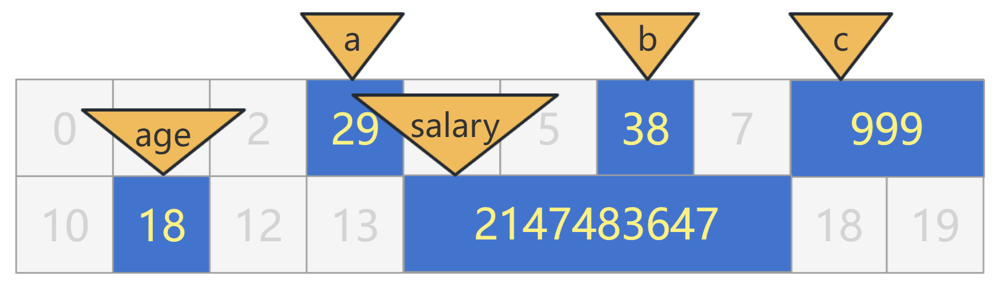

这样以来，其实我们也不再关心，这些标签到底在哪个格子里，只要给我找到格子把我的数据放进去就可以了。

```
movb $29, a
movb $38, b
movw $999, c
movb $18, age
movl $2147483647, salary
```

当然，我还需要再通过这个标签，把我刚刚放进去的数据找出来。

这很简单，但存在一个问题，放进去的时候，我们可以通过 movb，movw，movl 等知道占用多少个格子。而取出来的时候，标签上可没有写这个数据占用了多少个格子，这是有问题的。

因此，在定义这个标签时，不能光取个名字，还需要有个信息就是，这个标签对应的数据，占了多少个格子。

我们就效仿刚刚的存放操作，也规定一系列单词，来修饰这些标签，表示占用了多少个格子。

char 表示 1 个字节，short 表示 2 个字节，int 表示 4 个字节，long 表示 8 个字节 ...

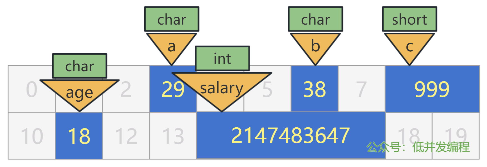

于是乎刚刚的 5 个数据，就可以表示为如下指令：

```c
char a = 29;
char b = 38;
short c = 999;
char age = 18;
int salary = 2147483647;
```

行了，我也别藏着掖着了，相信大家也知道，这里就是 C 语言的写法，而刚刚那堆 mov 是汇编语言的写法。

这些 char a，char b，int salary 等，就是变量！记住，变量不但要有名字，还得有类型！


## 变量定义与赋值

其实，刚刚写法，是把变量的定义与赋值操作写在一行了。

比如有如下语句：

```c
int a = 1;
```

实际上是分成两步的：

```c
// 变量的定义
int a;
// 变量的赋值
a = 1;
```

其中变量的定义是为了程序员后面去用它赋值，这部分不是给 CPU 看的。

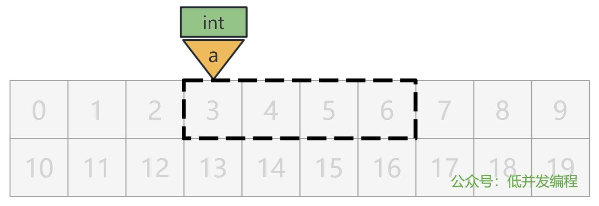

而变量的赋值才是真正在内存中把数据放进去，这部分才真正涉及 CPU 具体指令的执行。

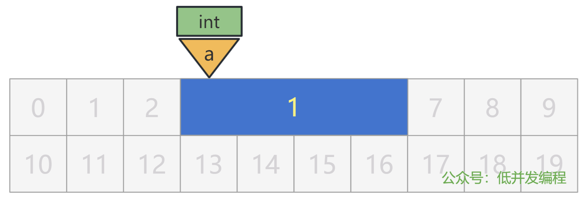


## 指针

现在，让我们把内存清空，回到一开始的那一片净土上。


现在，我来搞点花样。我将我的密码（1234）存储在一个 short a 中，假设这个变量 a 被放在了 6 号格子处。


同时，我将这个变量 a 的地址，也就是 6 这个数字，存储在另一个变量 int p 中，假设这个变量 p 被放在了 1 号格子处。

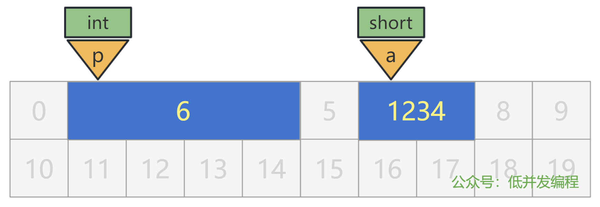

这样，我寻找我密码的方式，就是先通过 p 所在的内存地址找到里面存的值，也就是 a 的内存地址 6，再通过 a 的内存地址找到里面存的值，也就是我要找的密码 1234。

我们可以用下面的代码来表示刚刚的存放逻辑。

```c
short a = 1234;
// 假设我们已经知道上面的变量 a 被放在了 6 号格子处
int p = 6;
```

这里的 p 和 a 都是变量，只不过，p 这个变量有点特殊，它里面存放的值是一个内存地址，我们把 p 这个变量形象地成为指针变量，简称指针。

不过，这样有几个问题，我一个个来说。

### 1. 取地址

首先，我们在编码阶段，无法知道也无需知道变量 a 会存放在哪里，不然就失去了标签的含义，又回到了需要关心具体的内存地址（也就是格子编号）的时代了。

所以，我们应该有个方法，来在编码阶段表示变量 a 的地址的含义，姑且就叫做 &a 吧。

那么我们的代码，就可以优化为：

```c
short a = 1234;
// 假设 a 的地址是 6，那么下面的 p 就等于 6
int p = &a;
```

用图来表示就是：

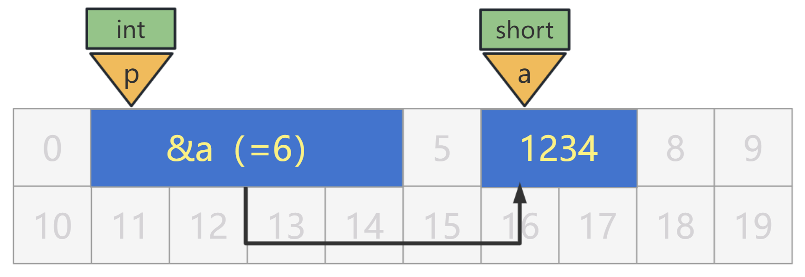

### 2. 指针变量本身的大小

视角放到这个变量 p 身上，虽然本质上这个变量 p 里面存放的就是一个数值，假设是 6，但是它却表示了一个内存地址的值。如果让程序员随便规定这个变量 p 的数据类型（也就是占多少个字节），那显然容易出问题。

比如内存地址是 999，那么我用一个 char 类型的变量 p 来存放它，就会有问题。

我们在编码阶段是无法确定一个内存地址的值是多少，那么用什么类型的变量来存放它，也是无法判断的。

所以，最稳妥的办法就是，用一个完全能容纳所有内存地址范围的变量类型来存放指针变量，我们姑且认为我们是在一个 32 位的系统上，那么用一个 4 字节大小的变量来存放，就可以了。（当然，实际上这取决于你的编译器的位数）

现在，我们的指针变量所占用的内存大小，就是 4 个字节，也就是 4 个格子，我们就可以把 p 前面的数据类型去掉了。

```c
short a = 1234;
p = &a;
```

### 3. 指针变量的类型

刚刚我们解决了指针变量本身所占用的内存大小，但是还有一个问题没有解决，就是指针变量里存放的内存地址处的变量的大小。

也就是说，上面的指针变量 p 里虽然存放了变量 a 的内存地址 6，但是指针变量 p 却没有任何信息，来说明内存地址 6 处的变量，它的大小是多少。

假如，我们认为内存地址 6 处的变量是个 char 类型，也就是只占用了一个字节，那么显然，会取出一个不符合预期的值。

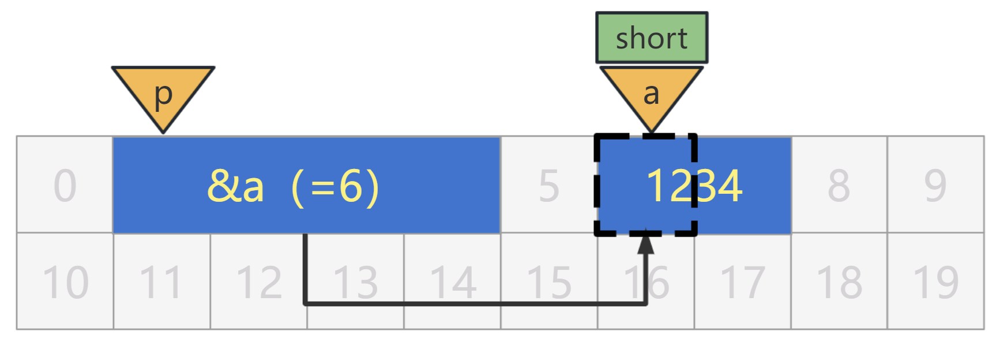

当然，如果认为 6 处的变量是个 int 类型，占 4 个字节，虽然数值上可能没有问题，但从某种程度上讲也是不太符合预期的。

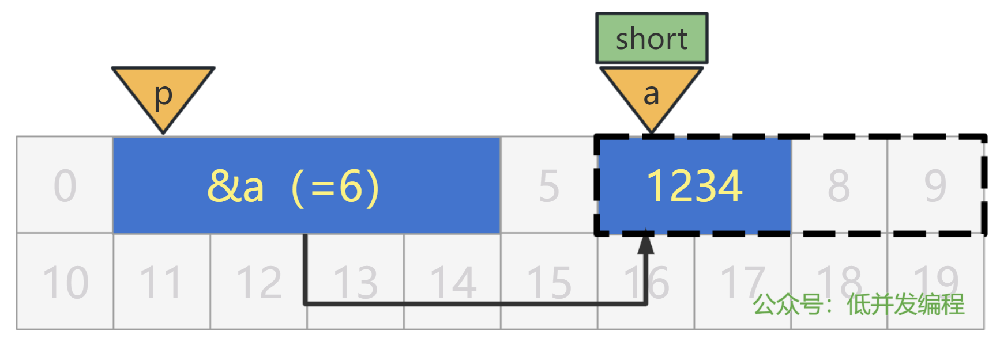

所以，必须得完全按照变量本身的类型，也就是 short 类型来读取此内存地址处的值，才是正确的。

那我们应该如何表示这个信息呢？即如何表示，变量 p 是一个指针，且这个指针里面存放的内存地址处的变量的类型是 short。

很好办，直接说答案吧。

```c
short a = 1234;
short * p = &a;
```

p 前面的 * 表示变量 p 是一个指针类型，再前面的 short 表示该指针指向的内存地址处的变量，是个 short 类型的变量。

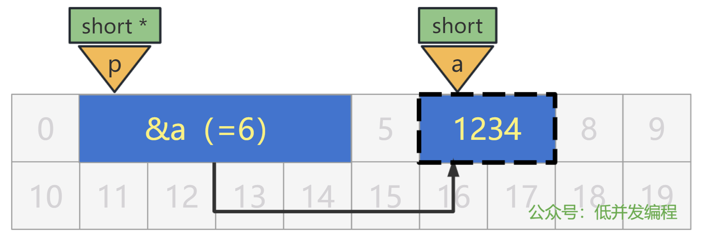

注意哦，这个 short 不是指针变量本身的类型，指针变量本身我们前面说过了，就是固定的 4 字节大小。

不过总是这样说太绕口了，今后我们就说，变量 p 是个 short * 类型的指针，就可以了。

用上面的图形象地说就是，右边变量 a 蓝色的填充，表示 a 是个 short 类型，而外面的虚线框框，表示指针 p 按照 short 类型的变量来"解读"内存地址 6 处的数值。

两者相匹配了，就是"正确"的编程代码了。

### 4. 指针所指向的值

上面我们已经可以获得某个变量的地址，比如获取 a 的地址就是：

```
&a
```

同时我们也可以定义一个指针变量，比如定义一个 short * 类型的指针变量 p：

```
short * p;
```

并且，我们通过直接赋值操作，可以给指针变量进行初始化：

```
p = &a;
```

当然，上面的代码也可以连起来写，即指针变量 p 的定义与初始化写在同一行：

```
short * p = &a;
```

不过，我们还没有一个方法，来表示指针变量 p 所指向的那块内存。

那我们就发明一个，比如想把 p 所指向的那块内存的值改为 999，可以这样写。

```c
*p = 999;
```

这里的 * 就表示"指向"的含义，用图表示就是：

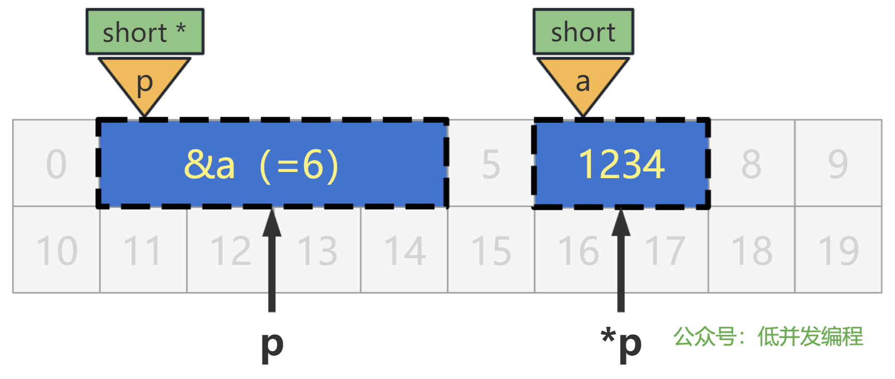

所以连起来一个完整的程序就是：

```c
short a = 1234;
// 指针的定义
short * p;
// 指针的初始化，也即指针变量本身的值
p = &a;
// 指针变量所指向的内存地址的值
*p = 999;
```

执行过后，a 的值会变成 999。


### 5. 指针的加减

如果对一个普通变量 +1，比如说：

```
int a = 1;
int b = a + 1;
```

那显然，b 的值应该是 2，毫无疑问。

但是如果对一个指针变量 +1，会怎么样呢？

```
int a = 1;
int *p = &a;
int *p2 = p + 1;
```

我们假设变量 a 放在了格子 1 处。

变量 a 的值是什么，以及变量 p 被放在了哪里，我们都不关心，就只盯着 p 的值看，显然，一开始的时候是 1。

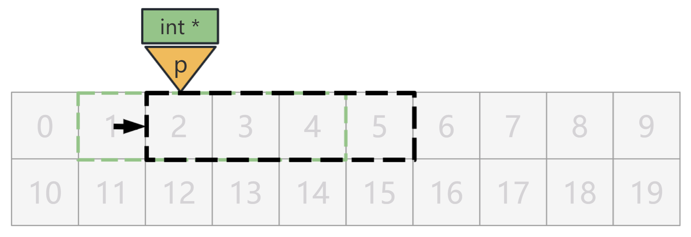

我们先不考虑，p + 1 应该是几，如果让你来设计这个语言，你觉得 p + 1 是几比较好呢？

我认为，只有两种较为合理的设计。

第一种，p + 1 就等于 2，就简简单单当做数值进行加法运算而已。

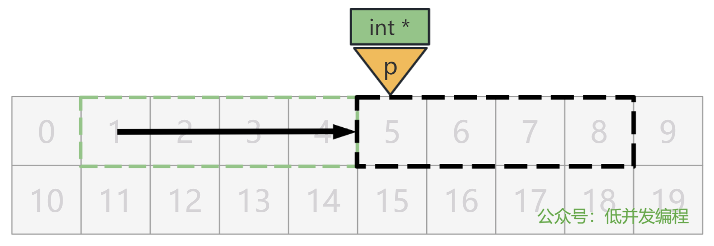

第二种，p + 1 等于 5，即跨过一个 p 所指向的内存单元的数据类型的大小，也就是 4 字节的 int。

你觉得那种比较合理呢？

那显然是第二种嘛！不然和普通变量有啥区别了，你既然规定了一个指针变量这个玩意，就需要让它发挥点方便程序员的作用，这才是你设计它的真正目的。

当然你不服，你就想让这个 int * 类型的指针变量，就真真正正在数值上只 +1，也就是让 p 等于 2，该怎么办呢？

很简单，分成三步就好了：

第一步，把 int * 类型的 p 强转为 char * 类型的 p。

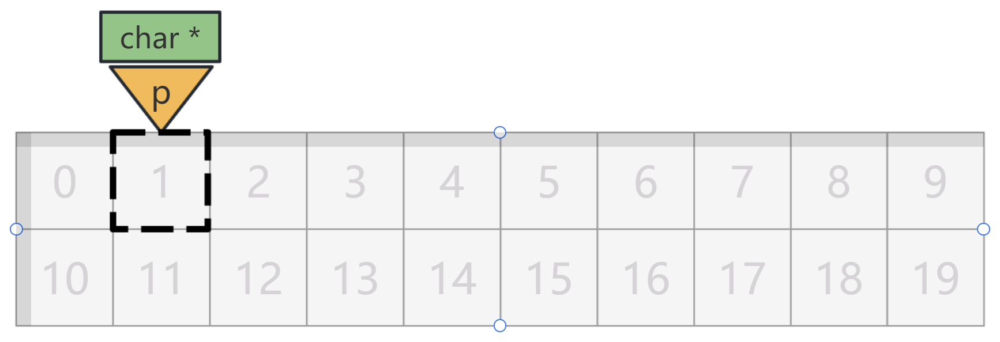

第二步，p + 1。

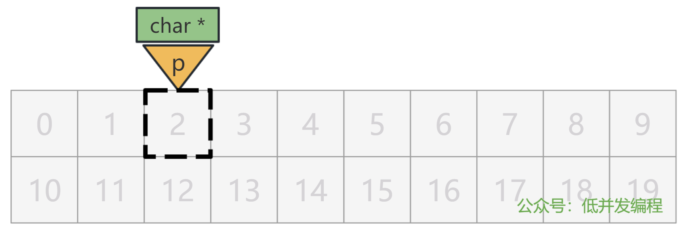

第三步，再把 char * 类型的 p 强转为 int * 类型。

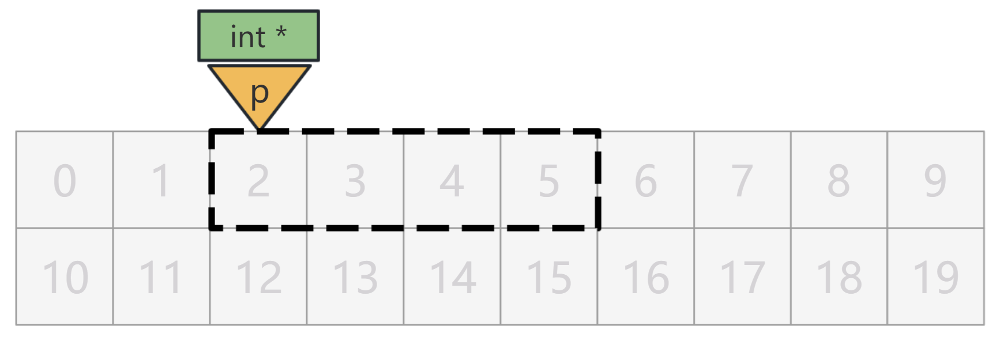

完事！用代码表示就是：

```
p = (int *)((char *)p + 1);
```

你会看到，C 语言项目中经常使用这样的操作。


## 指针的本质

我们看上面的一张图：


其实，别看上面又 short * p 又 short a 的，这是给程序员和编译器看的。

在 CPU 眼里，根本没有这些眼花缭乱的标签，以及五花八门的解读，就是 0 ~ 4 号格子里存了个数字 6，然后 6 ~ 7 号格子里存了个数字 1234，仅此而已。

更进一步讲，其实就只是 1 号格子里存储了数字 6（234 号格子是空的），6 号格子里存储了数字 12，7 号格子里存储了数字 34（当然实际得转换成二进制，再结合大端序还是小端序来看哈，我这里就是简单直观告诉大家 CPU 才不管那么多，就一个格子一个格子的放数字就完事了）

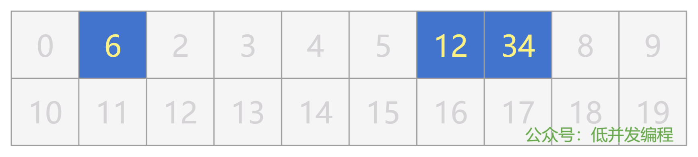

所以，我们经常听书上讲，让大家一定要记住，指针变量中只能存放地址，不要将一个整数或任何其他非地址类型的数据赋给一个指针变量了。

这种说法就非常别扭，很多书上，即想讲清楚指针的本质，又想讲清楚指针的注意事项，混杂在一起，让读者即没有搞清楚指针的本质，又不知道指针的注意事项。

说实话，就光看书而没有经过大量 C 语言的实践，谁能记得住或者理解透彻那些注意事项。而经过大量 C 语言实践的人，指针早就融入进血液中了，谁还来看你讲指针的本质？所以说，这块我觉得非常之矛盾。

实际上，指针变量的本质和普通变量是一样的：

普通变量，写个 short a，是在告诉编译器，当我 a = 1 时，你给我找到一块 2 字节的内存，把 1 填充进去。

指针变量，写个 short * p，是在告诉编译器两件事情：

当我 p = xxx 时，你给我找到一块 4 字节的内存（我们假设指针本身的大小固定 4 字节），把 xxx 填充进去；

当我 *p = yyy 时，你给我找到 xxx 内存地址，并且按照 short 类型也就是 2 字节大小，把 yyy 填充到这里。

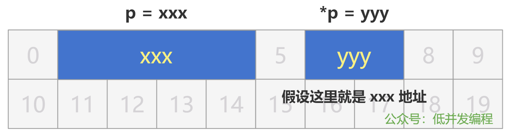

所以，谁说不能把一个整型变量赋给指针了，我这不就把一个整型变量 xxx 赋给指针 p 了么，我赋值的时候就说它是整型变量了，怎么的吧？

但是我用它的时候，我 *p 又把 xxx 看做是一个内存地址了，就去找内存 xxx 的地方，又怎么的吧？

用代码来表示就是：

我强行把一个整型数值 6 赋值给指针变量 p，然后 *p 去访问内存地址 6 并修改那个地方的值：

```
int * p = 6;
*p = 999;
```

我还可以把一个地址值，强行赋值给一个普通变量：

```
int a = 1;
int b = &a;
```

这时普通变量 b 里面存储着 a 的地址，我 *b 也同样可以访问到 a 并修改它的值：

```
*b = 999;
```

当然如果你真这么写编译器会报错，但没关系，我们可以先把普通变量 b 强转为指针变量，然后再 * 它：

```
*(int *)b = 999;
```

你还可以玩些更花哨的，虽然没啥用：

```
*((int *)*(&p)) = 999;
```

假如 a 的地址是 6 的话，其实你这些花里胡哨的操作，最后到人家 CPU 眼里，就是一条简单的指令：

```
movl $999, (6)
```

就是想把 999 放在 6 号格子嘛！

所以，不要把指针想得多么复杂和神圣，它就是方便了程序员编程，同时告诉编译器应该怎么编译成最终的指令。

你写了个 *p，就是把 p 的值当做内存地址去访问，在汇编语言层面就是加了个括号：

```
(p)
```

你写了个 &a，就是取出变量 a 的内存地址，在汇编语言层面就是 lea 指令：

```
lea a, xxx
```

你如果写了个 ***p 那就是，相当于加了三次括号：

```
(((p)))
```

当然啦，以上都是方便理解的伪指令，具体落实到真正的汇编语言，我会在后续的章节中讲述，直接从汇编语言理解指针，你就会发现指针就是个工具人而已。


## 写在最后

至此，我们的《你管这破玩意叫指针 -- 基础篇》就讲完了。

我们从最开始的内存格子出发，逐渐推导出类型系统和变量的作用，进而再引出本质上和普通变量没有任何区别的指针变量，最后再推导出指针变量相关的操作，带你看清了指针的本质。

你不要去记本文的知识点，重在整个推导的过程，要去理解指针想解决的问题是什么，它的合理性在哪，哪一部分信息是给程序员和编译器看的，哪一部分操作最终又是真正落实到 CPU 指令的，这些才是关键。

当然，我还是给你简单总结下知识点相关的部分，其实简单说，就这么几件事。

定义一个指针：

```
int * p;
```

赋值或初始化一个指针：

```
p = &a;
```

修改指针的内容：

```
*p = 999;
```

指针的加减（其实到后面讲的数组才有价值）：

```
p = p + 1;
```

完事，就这些！

最后，给大家推荐两个网站。

一个是将 C 语言代码实时编译成汇编代码，你可以用它来自己玩指针做实验，看它最终到 CPU 指令层面是什么样。

https://godbolt.org/

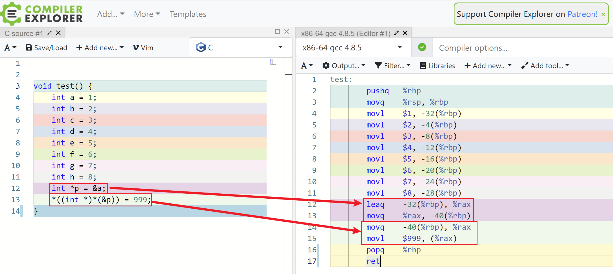

一个是 GNU C 手册，里面对各种语法和作用讲述的非常清楚，不要在百度搜博客了。

https://www.gnu.org/software/gnu-c-manual/gnu-c-manual.html

类型系统里的整型类型：

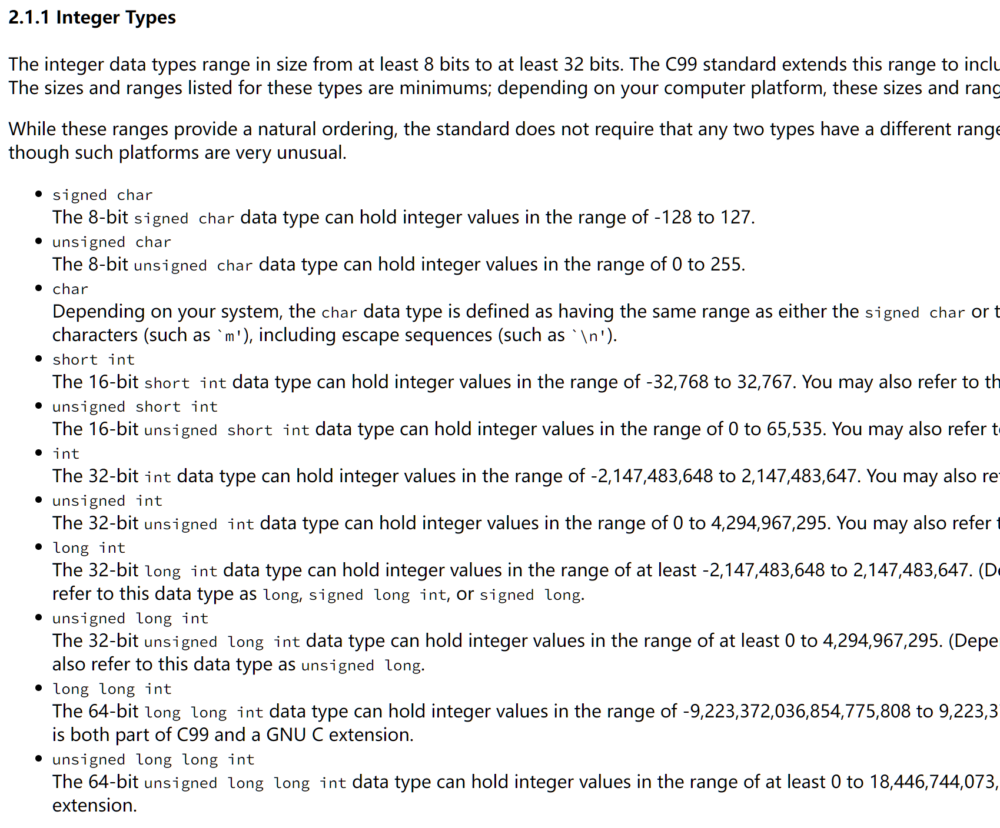

指针的定义和初始化：

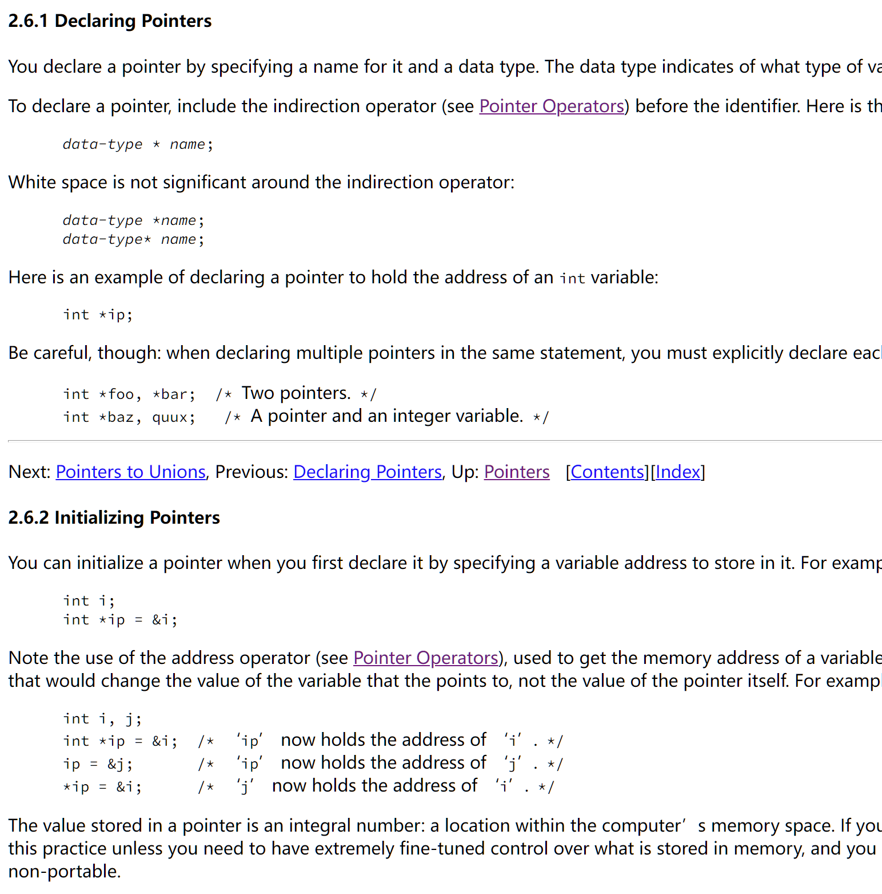

是不是有人想问，short * p 是不是应该写成：

short *p

或者

short* p

自己去上面的文档里找答案。

OK，本文到这里就终于要结束了，在接下来的进阶篇里，我会讲述二级指针、数组、函数指针、字符串、结构体、结构体数组与指针等内容。

虽然说是进阶篇，但我认为，指针的本质反而是进阶，而指针的进阶反而是基础。

因为假如理解了上述的一切，下面的所谓指针进阶玩法，都可以通过指针的本质以及语言设计的合理性，推导出来，再往后无非是需要花时间熟练使用和掌握罢了。

所以，理解好今天的内容，非常重要！


# 你管这破玩意叫指针 -- 进阶篇

通常情况下，上面讲述的，就是指针的基础用法，也是最核心的本质。

理解了上述的一切，下面的所谓指针进阶玩法，都可以通过指针的本质以及语言设计的合理性，推导出来。

所以我认为，指针的本质反而是进阶，而指针的进阶反而是基础。

让我们一起来看看，怎么个进阶法吧！

## 二级指针

假如，我们现在想要完成这样的事情，如图：

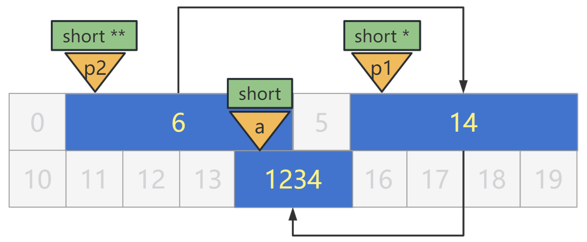

a 是 short 类型的一个变量，放在 14 处。

p1 是 short * 类型的指针，指向变量 a，放在 6 处。

p2 也是个指针，指向指针变量 p1，放在 1 处。

这时候 p2 的类型应该是什么呢？

类比一下就知道我们应该如何设计了，我们之前设计的指针 p，它指向的内存地址是变量 a，是 short 类型的，那我们就把指针 p 的类型写为了 short *。

类比下，现在我们的指针 p2，它指向的内存地址处的变量 p1，是 short * 类型的，那自然，我们再多个星星，就把指针 p2 的类型写为 short ** 就好了。

完整代码就是这样：

```c
short a = 1234;
short * p1 = &a;
short ** p2 = &p1;
```

那么我们如何使用 p2 来改变变量 a 的值呢？

很简单，我们前面说过，* 用在指针变量的定义上，就表示"它是指针"的含义，用在指针变量的赋值上，它表示"指向"的含义。

那 *p2 就表示 p2 指向的内存地址处的值，也就是 p1 的值。

p1 的值也是个 short * 指针类型，那我们还得再来个星，表示 p1 所指向的内存地址。

那么都叠加到 *p2 身上，就是 **p2。

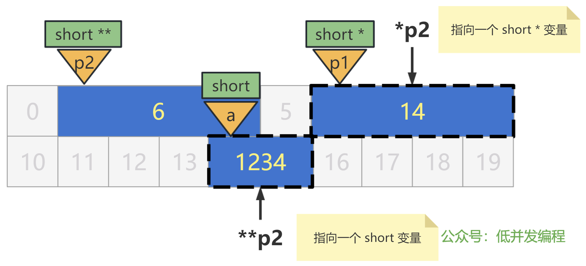

用代码表示就是：

```
short a = 1234;
short * p1 = &a;
short ** p2 = &p1;
// 使用 p2 修改 a 的值为 999
**p2 = 999;
```


# 你管这破玩意叫指针 -- 变态篇


# 参考资料与工具

GNU C Manual：https://www.gnu.org/software/gnu-c-manual/gnu-c-manual.html

在线观察 C 语言的汇编代码：https://godbolt.org/

